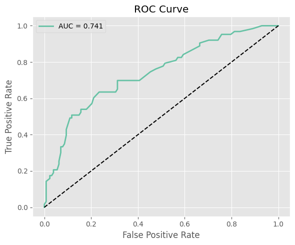

# German Credit Risk Prediction

I built this project to understand how machine learning can be used to predict whether a customer is likely to become a credit risk. Banks collect information such as a customer's age, occupation, savings, checking account balance, loan amount and repayment duration before approving a loan. Instead of relying only on manual judgement, these factors can be used to train a machine learning model that estimates the customer's credit risk.

For this project, I used the German Credit dataset and developed the complete workflow in Python using Google Colab. Rather than jumping directly to model building, I started by cleaning the dataset, checking missing values, understanding the variables, encoding categorical features and preparing the data for machine learning. After preprocessing, the dataset was divided into training and testing sets, numerical variables were standardized where required, and multiple classification models were trained and evaluated.

Instead of relying on a single algorithm, I wanted to compare different approaches. Logistic Regression was used as a simple baseline model, followed by Decision Tree and Random Forest. Finally, I trained an XGBoost classifier, which achieved the best performance among all the models tested.

The final model accuracies obtained in this project are shown below.

| Model | Accuracy |
|--------|---------:|
| Logistic Regression | **0.82** |
| Decision Tree | **0.80** |
| Random Forest | **0.86** |
| XGBoost | **0.88** |

Although accuracy was the primary comparison metric, I also evaluated the models using confusion matrices, ROC-AUC curves and feature importance analysis to better understand how well each model distinguished between good and bad credit risk. These visualizations helped explain why XGBoost performed better than the other algorithms on this dataset.

The repository contains the complete notebook used for the analysis, the cleaned dataset, the trained XGBoost model saved using Joblib, comparison results for all models and the visualizations generated during the project. The folder structure is organised so that each component of the project can be accessed independently.

```
German_Credit_Risk_Prediction
│
├── images/        # Project visualizations
├── models/        # Saved XGBoost model (.pkl)
├── results/       # Model comparison results
├── german_credit.csv
├── German_Credit_Risk_Prediction.ipynb
└── README.md
```

Working on this project helped me understand the complete machine learning pipeline rather than just training a model. It reinforced concepts such as preprocessing categorical variables, feature scaling, train-test splitting, model evaluation, overfitting, ROC-AUC analysis and comparing multiple algorithms before selecting the final model. It also gave me practical experience in organising a machine learning project on GitHub.


## Project Visualizations

The figures below summarize the most important stages of the analysis and the performance of the final models.

### Credit Risk Distribution

This plot shows the distribution of good and bad credit risk customers in the dataset before model training.


---

### Confusion Matrix

The confusion matrix illustrates how well the final model classified customers into good and bad credit risk categories.


---

### ROC-AUC Curve

The ROC curve evaluates the model's ability to distinguish between the two credit risk classes across different classification thresholds.



---

### Feature Importance

This visualization highlights the variables that contributed the most to the predictions made by the XGBoost model.


---

### Model Comparison

The final comparison of all four machine learning models shows that XGBoost achieved the highest prediction accuracy.


This project can be extended further by tuning model hyperparameters, performing cross-validation and deploying the trained model as a simple web application that predicts the credit risk of new loan applicants.

---

**Tools and Libraries:** Python, Pandas, NumPy, Matplotlib, Seaborn, Scikit-learn, XGBoost, Joblib, Google Colab

**Author:**
Atulya Singh  
Master's in Economics

Delhi School of Economics


